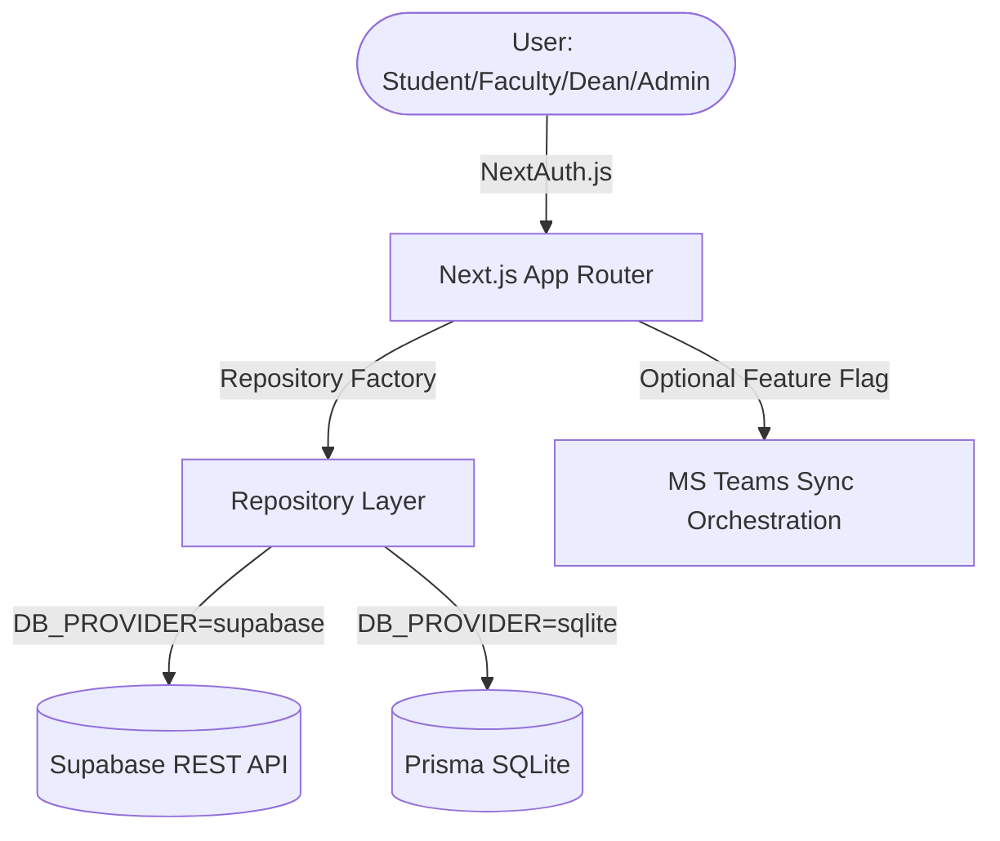

# E-Consultation — Architecture, Workflows & Roadmap

This document outlines the system architecture, core workflows, data models, and feature roadmap for the E-Consultation management system.

---

## 1. System Overview & Architecture

The E-Consultation system is an academic consultation and internal meeting management platform built using a modern stack of **Next.js 16**, **Supabase** (PostgreSQL in production), **SQLite** (via Prisma in local development), and **Tailwind CSS 4**.



### Core Repository Pattern
To maintain flexibility and clean data access patterns, a Repository Factory (`lib/repositories/factory.ts`) dynamically resolves the data provider based on environment variables:
- **Supabase Provider** (`lib/repositories/supabase.ts`): Resolves queries via PostgREST/Supabase client, eliminating heavy ORM overhead in serverless production environments.
- **SQLite Provider** (`lib/repositories/prisma.ts`): Utilizes Prisma client locally, perfect for lightweight, offline-first development.

---

## 2. Unified Meeting Architecture

A major architectural update has been implemented to unify all appointment and meeting systems. The legacy `internal_meetings` and `internal_meeting_participants` tables are deprecated. 

Now, both **student consultations** and **faculty internal meetings** are handled by a single unified table: `appointments`.

| Scenario | `meetingType` | `studentId` | Attendees (`appointment_attendees`) | Status Flow |
| :--- | :--- | :--- | :--- | :--- |
| **Student Consultation** | `CONSULTATION` | Required (Student User) | Faculty & Student (Auto-joined) | `PENDING` &rarr; `APPROVED` / `REJECTED` &rarr; `COMPLETED` / `CANCELLED` |
| **Faculty Internal Meeting** | `INTERNAL` | Null (or unused) | Invited Faculty/Deans/Admins | `PENDING` &rarr; `APPROVED` (or `CONFIRMED`) / `REJECTED` &rarr; `COMPLETED` / `CANCELLED` |

---

## 3. Core Features & Workflows

### A. Availability Rules Engine (`/faculty/availability`)
- Faculty can customize availability rules per day of the week (0 = Sunday, 6 = Saturday).
- Supports date-range scoping (`startDate`, `endDate`), blocking/unblocking slots, and custom time limits.
- Weekdays default to `08:00–18:00` unblocked; weekends default to blocked.
- Optimistically saved to the database via `POST /api/availability-rules`.
- *Note*: Availability rules solely impact **Student bookings** to prevent conflicts; they do not block administrative scheduling.

### B. Student Booking Workflow (`/student`)
- Students can browse available slots for selected faculty based on availability rules.
- Supports single booking as well as **staggered & multi-faculty bookings**.
- Displays descriptive inputs including Title, Description, and invited Attendees.
- Supports conflict-checking (both for student and faculty) during the reservation process.

### C. Faculty Dashboard & Management Workflow (`/faculty`)
- **Metric Cards**: Offers quick computations for Total, Pending, and Completed consultations.
- **Appointment Tabs**: Filterable list (`All`, `Pending`, `Accepted`, `Completed`, `Cancelled`) via `<FacultyAppointmentTabs>`.
- **Details Page** (`/appointments/[id]`): Displays detailed information including uploaded attachments, action notes, and Teams synchronization progress.
- **Actions**:
  - **Accept**: Moves status to `APPROVED` and generates a Microsoft Teams link (if enabled).
  - **Decline**: Moves status to `REJECTED`.
  - **Complete**: Moves status to `COMPLETED` and prompts for "Action Taken" / "Additional Remarks".
  - **Cancel**: Available for the creator or faculty to cancel meetings, triggering notification logic.

### D. Microsoft Teams Integration
- Controlled via `FEATURE_CREATE_TEAMS_MEETING` master toggle.
- When an appointment is approved, the system queues MS Teams sync state.
- **Sync Tracking Fields**:
  - `teamsSyncStatus` (`UNWRITTEN`, `WRITTEN`, `FAILED`)
  - `teamsSyncRetries`, `teamsSyncError`, `teamsSyncLastAttempt`
- **Orchestration**: A cron-triggerable endpoint at `POST /api/admin/sync-teams` acts as an out-of-band processor to reconcile failed or pending meeting creations in Microsoft Entra.

### E. Interactive Onboarding Walkthrough
- First-time users see a role-based step-by-step tour on their dashboard after login.
- Detection via `onboardingVersion` column on the `users` table (`0` = unseen, `1` = completed).
- Three role-specific walks:
  - **Student**: Book a consultation → Track appointments → Done.
  - **Faculty**: Manage consultations → Set availability → Create meetings → Done.
  - **Dean**: Dashboard overview → Department reports → Import users → Done.
- Modal overlay with backdrop blur, step dots, icons, and Next/Back/Skip navigation.
- On dismiss, `POST /api/auth/onboarding` sets `onboardingVersion = 1` and refreshes the page.
- No auth flow changes — decoupled from `hasLoggedInBefore` and activation logic.

---

## 4. Key UI & Performance Patterns

1. **Double-Click Prevention**:
   All form submissions and action buttons leverage `SubmitButton` (`components/SubmitButton.tsx`), backed by a custom `useRef` lock. It disables input re-entry for 500ms after the first click, avoiding race conditions or duplicated API calls before React completes its re-render.
2. **Skeleton UI Placeholders**:
   Client-side pages that fetch data on mount display structured skeleton skeletons (`components/Skeleton.tsx`) instead of generic loading spinners or text.
3. **Redirect Guard on Login**:
   The login page verifies the user's active session (`useSession()`) on mount. Authenticated users are immediately routed to their role-specific dashboard (`/student`, `/faculty`, `/dean`, `/admin`), creating a seamless transition.

---

## 5. Unified Data Model

```
appointments
├── id (UUID)
├── studentId (FK users, nullable for INTERNAL)
├── facultyId (FK users)
├── sessionGroupId (Text, links batch bookings)
├── createdByEmail (Text)
├── meetingType (CONSULTATION | INTERNAL)
├── date (Text, YYYY-MM-DD)
├── startTime (Text, HH:MM)
├── endTime (Text, HH:MM)
├── title (Text)
├── description (Text)
├── status (PENDING | APPROVED | REJECTED | COMPLETED | CANCELLED)
├── actionTaken (Text)
├── additionalRemarks (Text)
├── teamsLink (Text)
├── teamsSyncStatus (UNWRITTEN | WRITTEN | FAILED)
├── teamsSyncRetries (Int)
├── teamsSyncError (Text)
├── teamsSyncLastAttempt (Timestamptz)
├── requestedAt (Timestamptz)
└── updatedAt (Timestamptz)

appointment_time_slots
├── id (UUID)
├── appointmentId (FK appointments, ON DELETE CASCADE)
├── date (Text)
├── startTime (Text)
├── endTime (Text)
├── teamsLink (Text)
└── createdAt (Timestamptz)

appointment_attendees
├── id (UUID)
├── appointmentId (FK appointments, ON DELETE CASCADE)
├── userId (FK users)
├── status (INVITED | ACCEPTED | DECLINED)
└── isMandatory (Boolean)

appointment_files
├── id (UUID)
├── appointmentId (FK appointments, ON DELETE CASCADE)
├── fileName (Text)
├── fileType (Text)
├── fileData (Text / Base64 payload)
├── fileSize (Int)
└── createdAt (Timestamptz)
```

---

## 6. Feature Roadmap

Based on current progress, here is the feature execution progress:

- [x] **Phase 1: Availability Rules Engine** — Custom rules and date-scoped configurations.
- [x] **Phase 2: Faculty Dashboard Tabs** — Filtered appointment lists with interactive cards.
- [x] **Phase 3: Faculty Cancel Flow** — Cancellation rules and user interfaces.
- [x] **Phase 4: Student Cancellation** — Allowing student-initiated cancel flows.
- [x] **Phase 5: Faculty-to-Faculty Meetings** — Fully integrated into unified `appointments` system.
- [x] **Phase 6: Sync Tracking Fields** — Built columns tracking Teams syncing.
- [x] **Phase 7: Teams Sync Orchestration** — Out-of-band cron triggers for sync.
- [x] **Phase 8: Conflict Detection w/ Teams** — Overlap warnings and blocking.
- [x] **Phase 9: Enhanced Booking** — Booking with Title, Description, and Attendees.
- [x] **Phase 10: Department & Dean Role** — Added `DEAN` views, `departments` tables.
- [x] **Phase 11: ETL — Bulk User Import (CSV)** — Administrative CSV upload system.
- [x] **Phase 12: Email-based Auth & Password Setup** — Accounts activation flow at `/activate`.
- [x] **Phase 13: Consultation Completion** — Actions taken notes and reports input.
- [x] **Phase 14: Interactive Onboarding Walkthrough** — Role-based step-by-step tour for first-time users (Student, Faculty, Dean) triggered by `onboardingVersion` field.
- [x] **Phase 15: Reports & Export** — Summarization metrics, printable reports, and CSV outputs.
- [x] **Phase 16: Staggered & Multi-Faculty Booking** — Comprehensive multi-slot bookings.
